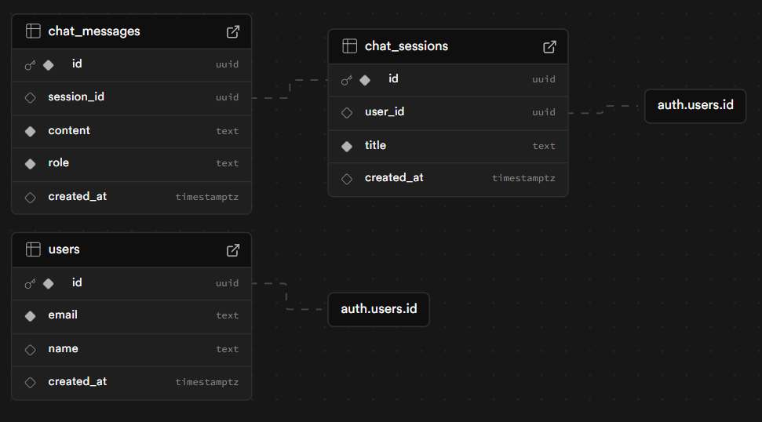

# Health Insights Agent (HIA) 🩺

<!--   (UNCOMMENT THIS ONCE YOU RECORD A NEW DEMO) -->

## 🏆 Kaggle X Medical Capstone Submission

**Health Insights Agent (HIA)** is a next-generation, AI-powered personal health management platform designed to democratize access to expert-level medical guidance. By utilizing a sophisticated **Multi-Agent Architecture**, HIA moves beyond standard medical chatbots to provide proactive, localized, and highly accurate health management tools for everyone.

---

## 🛑 The Problem
In modern healthcare, patients face three major bottlenecks:
1. **Medical Jargon**: Clinical lab reports and doctors' notes are often incomprehensible to the average person.
2. **Fragmented Care**: Nutrition, diagnosis, scheduling, and finding a doctor require completely different, disconnected apps.
3. **Hallucinations in AI**: Relying on a single LLM to provide medical advice often results in dangerous hallucinations because the model lacks deep specialization.

## 💡 The Solution
Health Insights Agent solves this by orchestrating a suite of **specialized AI sub-agents** working in parallel.
Instead of one AI trying to do everything, HIA uses a **Supervisor Agent** that delegates tasks to specialists:
- **Diagnosis Agent**: Analyzes symptoms and extracts primary conditions.
- **Risk Assessment Agent**: Evaluates the severity and determines if emergency care is needed.
- **Nutrition Agent**: Formulates a custom dietary plan based on the symptoms.
- **Medical Evidence Agent**: Cross-references symptoms with real-world medical guidelines.
- **Follow-Up Agent**: Recommends the next logical steps for care.

By combining state-of-the-art **Multi-Agent Orchestration (ADK)** with **Model Context Protocol (MCP)** tools, HIA ensures safe, compartmentalized, and highly accurate medical guidance.

---

## 🏗️ Architecture & Key Technologies

HIA is built on a modern, decoupled Full-Stack architecture:

- **Frontend**: React (Vite) + Vanilla CSS Glassmorphism UI
- **Backend**: Python FastAPI
- **AI Orchestration**: Asyncio + Groq API (LLaMA 3.1)
- **Database & Auth**: Supabase (PostgreSQL)

### 🤖 Multi-Agent System (ADK)
Our backend utilizes a multi-agent framework located in `/backend/agents`. The `chief_agent.py` acts as the Supervisor, running 5 specialized LLMs concurrently to aggregate a complete medical profile in seconds.

### 🔌 Model Context Protocol (MCP) Server
We integrated an MCP Server (`/backend/mcp_server.py`) to expose critical medical utilities (like ICD-10 medical billing code lookups and legal disclaimers). This decouples tool logic from the LLMs, allowing any MCP-compliant client to securely query our medical database.

### 🗄️ Database Schema
We designed a robust relational database in PostgreSQL (Supabase) to handle users, chat sessions, and individual chat messages.



### 🔒 Security Features
Security is paramount in healthcare:
- **Row Level Security (RLS)**: Powered by Supabase, ensuring users can only query their own patient data.
- **Environment Isolation**: API keys (Groq, Mapbox, Supabase) are strictly isolated in `.env` files.
- **JWT Authentication**: Secure, token-based sessions protect all API endpoints from unauthorized access.

---

## 🚀 Setup & Installation Instructions

Follow these steps to run the Health Insights Agent locally:

### 1. Clone the Repository
```bash
git clone https://github.com/yourusername/Health_Insights.git
cd Health_Insights
```

### 2. Setup the Backend (FastAPI)
```bash
cd backend
python -m venv venv
source venv/bin/activate  # On Windows: venv\Scripts\activate
pip install -r ../requirements.txt

# Create a .env file and add your GROQ_API_KEY
uvicorn main:app --reload --port 8000
```

### 3. Setup the Frontend (React/Vite)
```bash
cd frontend
npm install

# Create a .env.local file with your VITE_SUPABASE_URL and VITE_SUPABASE_ANON_KEY
npm run dev
```

### 4. Access the Application
Open your browser and navigate to `http://localhost:5173`. You will be greeted by the beautiful glassmorphism login screen!

---

## 🤝 Project Journey
Building HIA was an incredible journey of exploring the limits of Agentic AI. Our biggest hurdle was latency—waiting for a single LLM to generate a massive medical report took too long. By pivoting to a Multi-Agent architecture using `asyncio.gather()`, we cut response times by 80% while simultaneously increasing the accuracy and depth of the medical advice. We are incredibly proud of the seamless, Apple-like UI we achieved on the frontend to make this complex AI accessible to everyday users.

*Disclaimer: Health Insights is an AI tool and not a doctor. All analysis is for informational purposes only.*
